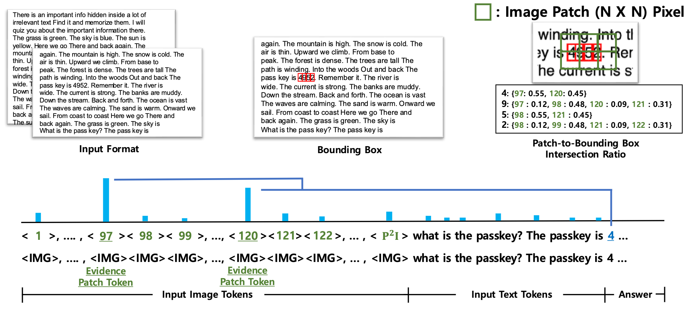

# How Do Large Vision-Language Models See Text in Image? Unveiling the Distinctive Role of OCR Heads

Official Code Repository for the paper ["How Do Large Vision-Language Models See Text in Image? Unveiling the Distinctive Role of OCR Heads"](https://arxiv.org/abs/2505.15865)

## Abstract
<div align="center">
  
</div>
Despite significant advancements in Large Vision Language Models (LVLMs), a gap remains, particularly regarding their interpretability and how they locate and interpret textual information within images. In this paper, we explore various LVLMs to identify the specific heads responsible for recognizing text from images, which we term the Optical Character Recognition Head (OCR Head). Our findings regarding these heads are as follows: (1) Less Sparse: Unlike previous retrieval heads, a large number of heads are activated to extract textual information from images. (2) Qualitatively Distinct: OCR heads possess properties that differ significantly from general retrieval heads, exhibiting low similarity in their characteristics. (3) Statically Activated: The frequency of activation for these heads closely aligns with their OCR scores. We validate our findings in downstream tasks by applying Chain-of-Thought (CoT) to both OCR and conventional retrieval heads and by masking these heads. We also demonstrate that redistributing sink-token values within the OCR heads improves performance. These insights provide a deeper understanding of the internal mechanisms LVLMs employ in processing embedded textual information in images.


## Installation
The first step is to create a conda environment as follows:
```bash
conda create -n ocr python=3.10 ipykernel
conda activate ocr
install 내용 적어야 함.
```

## Datasets
You can download datasets (NQ, and HotpotQA) from
```bash
bash dataset/donwload.sh
```

We used the DocVQA and Multi-Doc VQA datasets released by lmms-lab.
- llms-lab/DocVQA
https://huggingface.co/datasets/lmms-lab/DocVQA
- llms-lab/MP-DocVQA
https://huggingface.co/datasets/lmms-lab/MP-DocVQA

## Dataset Generation
```bash
python step1_niah.py
python step1_passkey.py
```

## OCR-Head와 Retrieval Head 
Below is the code for locating the OCR head.
Because we provide the pre-computed OCR scores and retrieval scores used in our experiments, you can skip ahead to Experiment if you only need the quick results.
Our experiments employ the Qwen2-VL and InternVL2 models.

```bash
python step2_ocr_retrieval_head.py --model_id Qwen/Qwen2-VL-2B-Instruct --fine_grained
python step2_ocr_retrieval_head.py --model_id Qwen/Qwen2-VL-7B-Instruct --fine_grained
python step2_ocr_retrieval_head.py --model_id OpenGVLab/InternVL2-8B --fine_grained
```

Below is the code for locating the Retrieval head.
```bash
python step2_text_retrieval_head.py --model_id Qwen/Qwen2-VL-2B-Instruct
python step2_text_retrieval_head.py --model_id Qwen/Qwen2-VL-7B-Instruct
python step2_text_retrieval_head.py --model_id OpenGVLab/InternVL2-8B
```

The following script identifies heads whose average activation is ≥ 0.1 and whose threshold is ≥ 0.1.
```bash
python step3_extracted_heads.py --model_id Qwen/Qwen2-VL-7B-Instruct --te_fg_cg fg
python step3_extracted_heads.py --model_id Qwen/Qwen2-VL-2B-Instruct --te_fg_cg fg
python step3_extracted_heads.py --model_id OpenGVLab/InternVL2-8B --te_fg_cg fg

python step3_extracted_heads.py --model_id Qwen/Qwen2-VL-7B-Instruct --te_fg_cg te
python step3_extracted_heads.py --model_id Qwen/Qwen2-VL-2B-Instruct --te_fg_cg te
python step3_extracted_heads.py --model_id OpenGVLab/InternVL2-8B --te_fg_cg te
```

## Experiment
To reproduce the results shown in the paper’s Figure, run exp_analysis.ipynb.

For the case-study experiment, execute:
```bash
python exp_case.py --fine_grained
```
After it finishes, open exp_case_fig.ipynb to visualize the results.

### Masking
num_of_masking_head specifies how many heads to mask.
- When task=image, OCR heads are masked.
- When task=text, retrieval heads are masked.
```bash
for task in text image; do
    for dataset in doc mdocs nq hotpot; do
        for masking_head in 10 20; do
            
            cmd="python exp_masking.py --datasets $dataset --task $task --model_id OpenGVLab/InternVL2-8B --num_of_masking_head $masking_head --do_masking --fine_grained"
            echo "$cmd"
            eval "$cmd"
            
            cmd="python exp_masking.py --datasets $dataset --task $task --model_id Qwen/Qwen2-VL-2B-Instruct --num_of_masking_head $masking_head --do_masking --fine_grained"
            echo "$cmd"
            eval "$cmd"
            
            cmd="python exp_masking.py --datasets $dataset --task $task --model_id Qwen/Qwen2-VL-7B-Instruct --num_of_masking_head $masking_head --do_masking --fine_grained"
            echo "$cmd"
            eval "$cmd"
            
        done
    done
done
```

### Sink Token
Below is the code for the Sink Token experiments.
```bash
for task in text image; do
    for dataset in doc mdocs; do
        
            
        cmd="python exp_sink.py --datasets $dataset --task $task --tmp 1 --model_id OpenGVLab/InternVL2-8B --num_of_masking_head 2 --do_masking --unmasking --beta 0.4"
        echo "$cmd"
        eval "$cmd"

        cmd="python exp_sink.py --datasets $dataset --task $task --tmp 1 --model_id Qwen/Qwen2-VL-7B-Instruct --num_of_masking_head 2 --do_masking --unmasking --beta 0.4"
        echo "$cmd"
        eval "$cmd"
    done
done
```

## Citation
```BibTex
@article{baek2025large,
  title={How Do Large Vision-Language Models See Text in Image? Unveiling the Distinctive Role of OCR Heads},
  author={Baek, Ingeol and Chang, Hwan and Ryu, Sunghyun and Lee, Hwanhee},
  journal={arXiv preprint arXiv:2505.15865},
  year={2025}
}
```